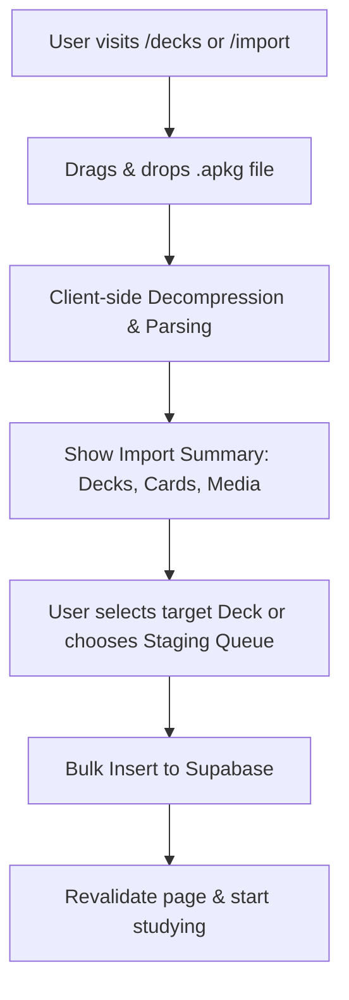

# VibeCard Integration Plan: Native .apkg Importer

This document details the architecture and implementation steps to allow VibeCard users to upload an Anki deck (`.apkg`) directly in the browser and import its cards, tags, and scheduling stats into the VibeCard database.

---

## 1. User Workflow



1. **Upload**: User drags and drops a `.apkg` file in the UI.
2. **Review & Map**: The system displays the decks found in the package and card counts. The user can:
   * Match Anki decks to existing VibeCard decks.
   * Auto-create new VibeCard decks.
   * Route the cards into the **Staging Area** (Approval Queue) for review, or import them directly.
3. **Import**: The system performs a bulk insert, mapping spaced repetition intervals.

---

## 2. Technical Architecture: Client-Side Parsing (WASM)

To minimize server load and avoid backend file uploads/storage overhead, we propose parsing `.apkg` files entirely in the client browser using WebAssembly.

### Key Browser Libraries
* **`jszip`** or **`fflate`**: For unzipping the `.apkg` archive in the browser.
* **`fzstd`**: For decompressing the zstd-compressed SQLite databases (`collection.anki21b` or `collection.anki21`).
* **`sql.js`** (SQLite in WebAssembly): For loading and querying the decompressed SQLite file inside the browser.

### Client-Side Processing Pipeline (Javascript / Typescript)
```typescript
import { unzip } from 'fflate';
import { decompress } from 'fzstd';
import initSqlJs from 'sql.js';

async function parseApkg(file: File) {
  // 1. Unzip the package
  const arrayBuffer = await file.arrayBuffer();
  const zip = await new Promise<any>((resolve, reject) => {
    unzip(new Uint8Array(arrayBuffer), (err, unzipped) => {
      if (err) reject(err);
      else resolve(unzipped);
    });
  });

  // 2. Extract database
  let dbData: Uint8Array;
  let isCompressed = false;
  
  if (zip['collection.anki21b']) {
    dbData = zip['collection.anki21b'];
    isCompressed = true;
  } else if (zip['collection.anki21']) {
    dbData = zip['collection.anki21'];
    isCompressed = true;
  } else if (zip['collection.anki2']) {
    dbData = zip['collection.anki2'];
  } else {
    throw new Error("No Anki database found in package.");
  }

  // 3. Decompress zstd if necessary
  if (isCompressed) {
    dbData = decompress(dbData);
  }

  // 4. Load database with sql.js WASM
  const SQL = await initSqlJs({
    locateFile: file => `https://sql.js.org/dist/${file}`
  });
  const db = new SQL.Database(dbData);

  // 5. Query Decks & Cards
  // Retrieve deck configurations from the `col` table
  const colRes = db.exec("SELECT decks FROM col LIMIT 1");
  const decksConfig = JSON.parse(colRes[0].values[0][0] as string);
  
  // Extract cards, notes, and scheduling statistics
  const cardsRes = db.exec(`
    SELECT 
      n.flds, c.ivl, c.factor, c.reps, n.tags, c.did
    FROM notes n
    JOIN cards c ON c.nid = n.id
  `);
  
  const cards = cardsRes[0].values.map(row => {
    const fields = (row[0] as string).split('\x1f');
    const front = fields[0];
    const back = fields.slice(1).join('\n\n');
    
    // Ignore legacy dummy update card
    if (front.includes("Please update to the latest Anki version")) {
      return null;
    }

    return {
      front_text: front,
      back_text: back,
      interval: row[1] as number,
      ease_factor: (row[2] as number) / 1000.0,
      reps: row[3] as number,
      tags: row[4] as string,
      original_deck_id: row[5] as number,
      deck_name: decksConfig[String(row[5])]?.name || "Default"
    };
  }).filter(Boolean);

  db.close();
  return { decksConfig, cards };
}
```

---

## 3. Database Schema Mapping

Anki card scheduling maps directly to VibeCard's Supabase schema.

| Anki Source Column / Calculation | VibeCard Database Field | Description / Default Mapping |
| --- | --- | --- |
| `front` (`flds.split('\x1f')[0]`) | `front_text` | Text/HTML/LaTeX on front |
| `back` (`flds.split('\x1f')[1:]`) | `back_text` | Text/HTML/LaTeX on back |
| `factor / 1000.0` | `ease_factor` | SM-2 ease multiplier (e.g. `2.50`) |
| `ivl` | `interval` | Review interval (days). Default `0` |
| `reps` | `reps` | Total recall repetitions. Default `0` |
| `tags` (space-trimmed) | `tags` | Map space-delimited tags to comma-separated |
| *Calculated* (see below) | `next_review` | Calculated next review date |

### Calculating `next_review` timestamp
When importing scheduling progress, calculate the future date relative to the import timestamp:
```typescript
const nextReviewDate = new Date();
if (card.interval > 0) {
  nextReviewDate.setDate(nextReviewDate.getDate() + card.interval);
}
const nextReviewISO = nextReviewDate.toISOString();
```

---

## 4. Implementation Steps

1. **Install Web NPM Packages**:
   `npm install fflate fzstd sql.js`
2. **Create Browser Import Component**:
   * Build `/src/components/AnkiImporter.tsx` with standard file upload drag-and-drop.
   * Parse the file in a React `useEffect` or `onChange` handler.
3. **Draft UI Confirmation Step**:
   * Show card preview count.
   * Provide a dropdown selecting target Deck (or "Staging Queue" for manual approval).
4. **Supabase Bulk Insert**:
   * Call the server action `bulkInsertCards(cards)` in `/src/app/actions/card.ts` to perform batch inserts into Supabase.
